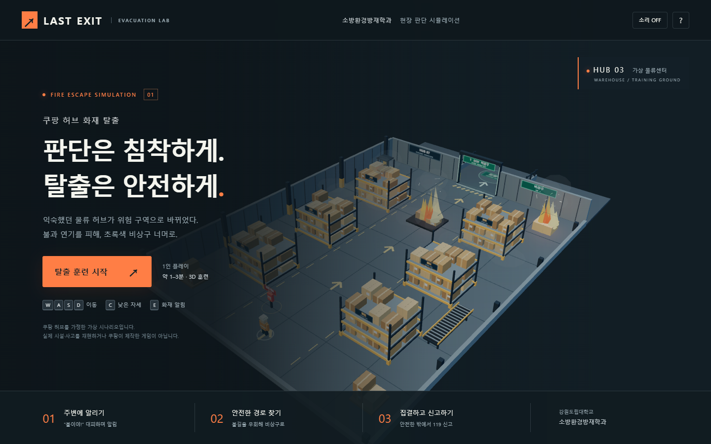

# LAST EXIT — 쿠팡 허브 화재 탈출

강원도립대학교 소방환경방재학과 수업을 위한 **Three.js 3D 화재 대피 게임**입니다. 가상의 물류센터에서 불길과 연기를 피해 비상구를 찾고, 옥외 집결지에서 119 신고 방법을 선택합니다.

## 다운로드하고 실행하기

**[게임 다운로드 · ZIP](https://github.com/yoon2566/1001_-game/releases/latest/download/last-exit.zip)**

1. 위 ZIP 파일을 다운로드합니다.
2. **압축을 풉니다.**
3. `쿠팡허브_화재탈출.html`을 Chrome 또는 Edge로 엽니다.
4. **탈출 훈련 시작**을 누릅니다.

설치·로그인·인터넷 연결이 필요 없습니다. 학생에게 HTML 한 파일만 전달해도 실행됩니다. 그래픽 가속(WebGL)을 지원하는 브라우저가 필요합니다.



## 조작 방법

| 키 | 기능 |
| --- | --- |
| WASD / 방향키 | 이동 |
| C | 낮은 자세 켜기 / 끄기 |
| E | 이동하며 “불이야!” 알림 |
| Esc | 일시정지 / 계속하기 |

모바일 화면에는 방향 버튼이 표시됩니다. 불길·연기를 우회하고 초록색 비상구를 지나 집결지에 도착하면 탈출에 성공합니다. 경보나 아이템은 출구를 여는 조건이 아닙니다.

## 수업에서 활용하기

- **[10분 수업 안내](수업안내.md):** 도입 → 첫 플레이 → 경로 비교 → 재도전 → 신고·재진입 금지 정리
- 빠른 기록보다 위험 노출을 줄이는 판단을 평가합니다.
- 낮은 자세도 연기 속 안전을 보장하지 않습니다. 연기 없는 경로를 우선합니다.
- PC 및 모바일 크기의 브라우저에서 탈출·신고·결과·재시작을 확인했습니다. 인터넷 연결을 끈 단독 HTML 실행도 확인했습니다.
- [디지털 검증 기록](검증/검증결과.json)

쿠팡 허브를 가정한 가상 시나리오이며 실제 시설·사고를 재현하거나 쿠팡이 제작한 게임이 아닙니다. 게임 수치는 실제 화재·인체 반응을 계산하지 않습니다. 실제 대피는 현장 안내와 119 지시에 따릅니다.

## 소스 수정

학생 실행에는 Node.js가 필요 없습니다. 개발 환경에서 수정할 때만 아래 명령을 사용합니다.

```powershell
node tools/build.cjs
node tools/serve.cjs
```

- `src/`: 화면, 스타일, 게임 로직, 3D 훈련장
- `vendor/`: Three.js와 라이선스
- `쿠팡허브_화재탈출.html`: 모든 실행 자원이 포함된 배포 파일
- 로컬 미리보기: `http://127.0.0.1:8765`

Three.js는 MIT 라이선스를 따릅니다. [라이선스 전문](vendor/THREE-LICENSE.txt)은 단독 HTML에도 포함되어 있습니다.
